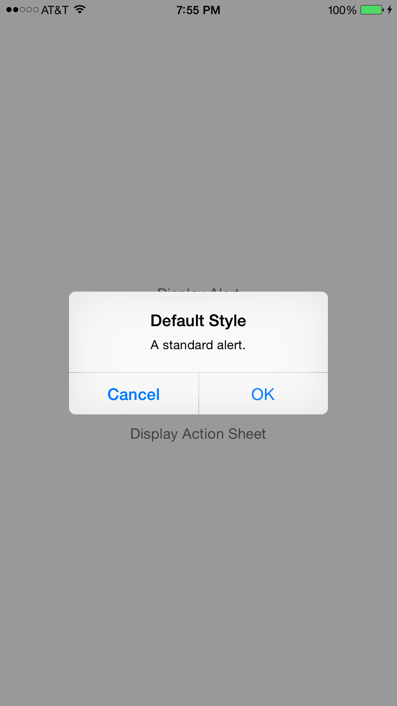
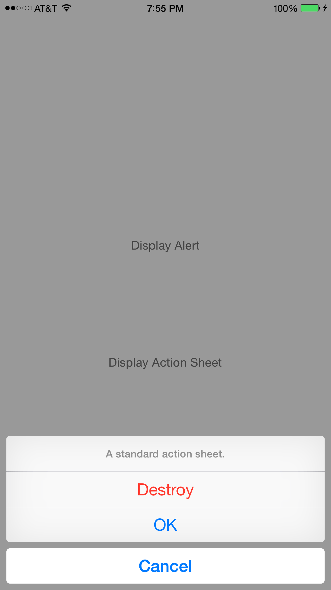

# LEAlertController

[](https://travis-ci.org/efremidze/LEAlertController)
[](http://cocoapods.org/pods/LEAlertController)
[](http://cocoapods.org/pods/LEAlertController)
[](http://cocoapods.org/pods/LEAlertController)

## Overview

`LEAlertController` is a lightweight `UIAlertController` extension for iOS 7 support. Fallbacks to using `UIAlertView` and `UIActionSheet` for iOS 7.




## Usage

### Installation

LEAlertController is available through [CocoaPods](http://cocoapods.org). To install
it, simply add the following line to your Podfile:

```ruby
pod "LEAlertController"
```

### Example

Use like a `UIAlertController`

```objectivec
LEAlertController *alertController = [LEAlertController alertControllerWithTitle:@"Default Style" message:@"A standard alert." preferredStyle:LEAlertControllerStyleAlert];

LEAlertAction *cancelAction = [LEAlertAction actionWithTitle:@"Cancel" style:LEAlertActionStyleCancel handler:^(LEAlertAction *action) {
    // handle cancel button action
}];
[alertController addAction:cancelAction];

LEAlertAction *defaultAction = [LEAlertAction actionWithTitle:@"OK" style:LEAlertActionStyleDefault handler:^(LEAlertAction *action) {
    // handle default button action
}];
[alertController addAction:defaultAction];

[self presentAlertController:alertController animated:YES completion:nil];
```

## Contributions

Contributions are totally welcome.

## License

LEAlertController is available under the MIT license. See the LICENSE file for more info.
